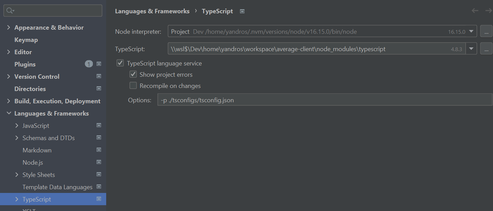
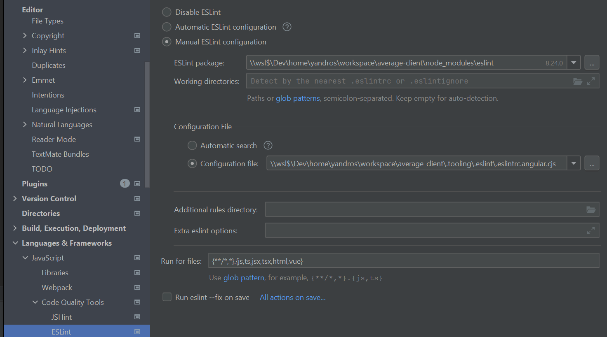

# .Tooling

# About 

Dottooling is a ready to use setup to kickstart a typescript/node project with the right quality tools working out of the gate.

# Next 
Automate installation and distribute as a package ?

## Installation

### 1. Clone the repos in the repository root dir.

```shell
git clone git@github.com:romain-cambonie/.tooling.git
```

### Remove the git configuration
```shell
rm -rf ./tooling/.git
```

### 2. Install devDependencies

Base:
```shell
yarn add -D typescript
yarn add -D husky 
yarn add -D @commitlint/cli @commitlint/config-conventional
yarn add -D prettier
yarn add -D @types/jest @types/node jest ts-jest ts-node
yarn add -D concurrently
yarn add -D eslint @typescript-eslint/eslint-plugin @typescript-eslint/parser eslint-config-prettier 
yarn add -D lint-staged 
```

Add if using Jest
```
yarn add -D eslint-plugin-jest
```

Add if using Angular
```
yarn add -D @angular-eslint/eslint-plugin @angular-eslint/eslint-plugin-template @angular-eslint/template-parser
```

Add if using Rxjs or Angular
```
yarn add -D eslint-plugin-rxjs
```

Also add if using Angular and Rxjs 
```
yarn add -D eslint-plugin-rxjs-angular
```


### 3. Install husky and set hooks as executable

```shell
husky install
mv ./.tooling/.husky .husky
```
and
```shell
chmod a+x .husky/commit-msg
chmod a+x .husky/pre-commit
chmod a+x .husky/pre-push 
```

### 4. Get .editorconfig 

```shell
mv ./.tooling/.editorconfig .editorconfig
```

### 5. Add the scripts in your package.json
```json
{
  "lint": "eslint --config=./.tooling/.eslint/.eslintrc.cjs  ./src/",
  "lint-staged": "lint-staged --config=./.tooling/.lintstaged/.lintstagedrc",
  "prettier": "prettier --config=./.tooling/.prettier/.prettierrc.cjs  --write  ./src/",
  "prettier:check": "prettier --config=./.tooling/.prettier/.prettierrc.cjs --check ./src/",
  "test": "jest --config=./.tooling/.jest/jest.config.ts"
}
```

// TODO Better documentation from here

With Angular
```
 "lint": "eslint --config=./.tooling/.eslint/.eslintrc.angular.cjs  ./src/",
```

5.1 Alternative, hide the configurations paths, easier ide configuration
create 

// TODO Better documentation to here


### Configuration override

## TODO Ide configuration : TsConfigs


## TODO Ide configuration : Eslint

